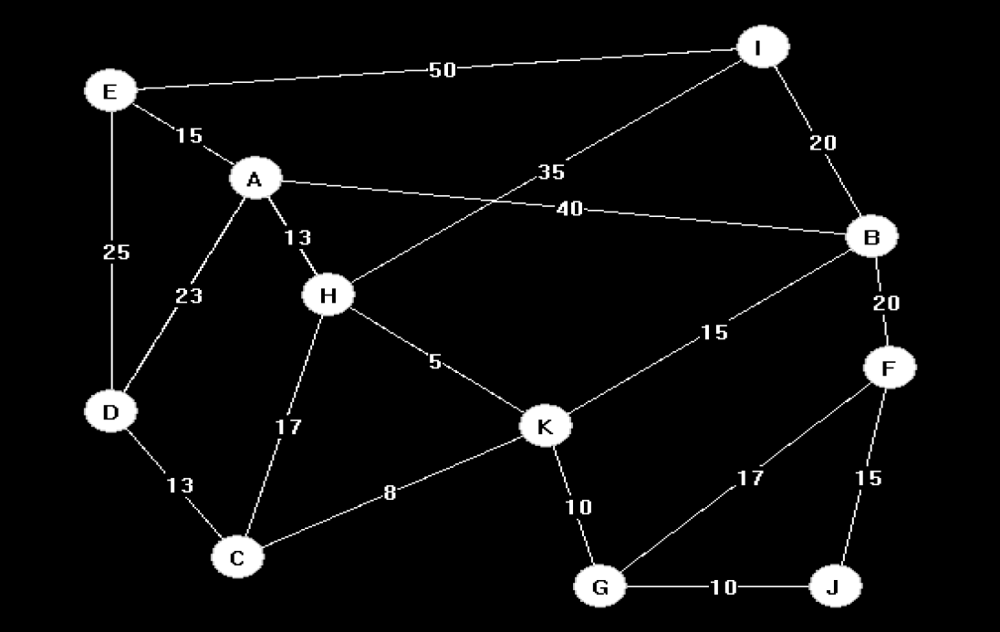

# Draw Graphs in C++

*I was looking for a graphics.h project,* 
*One day my friend asked me "Did you ever come across any code which Draws the given input graph?",* 
*I replied... wait-for-it!*

*...4hrs later...*

### BAM!!!

First STL to implement graph using adjacency list representation, then using function from graphics.h and math.h we can create a graph of, circles as vertices and lines as edges.

**Files can be edit according to comments given within files.**

There are 2 files:

- `weighted.cpp`: Adds weight in middle of edge.

- `unweighted.cpp`: Does not do anything.

  

There are 2 options for positioning of vertices:

- Circle: It divides `360°` with number of vertices to get angular distance between each points.

- Random: Random `(x, y)` coordinates.

  

There are 2 options for edges:

- Directed: It add a little `*` to the edge towards directed vertex. (at 5/6th of the edge)
- Undirected: Does not add any symbol.

### random_weighted_undirected_graph.png

  

